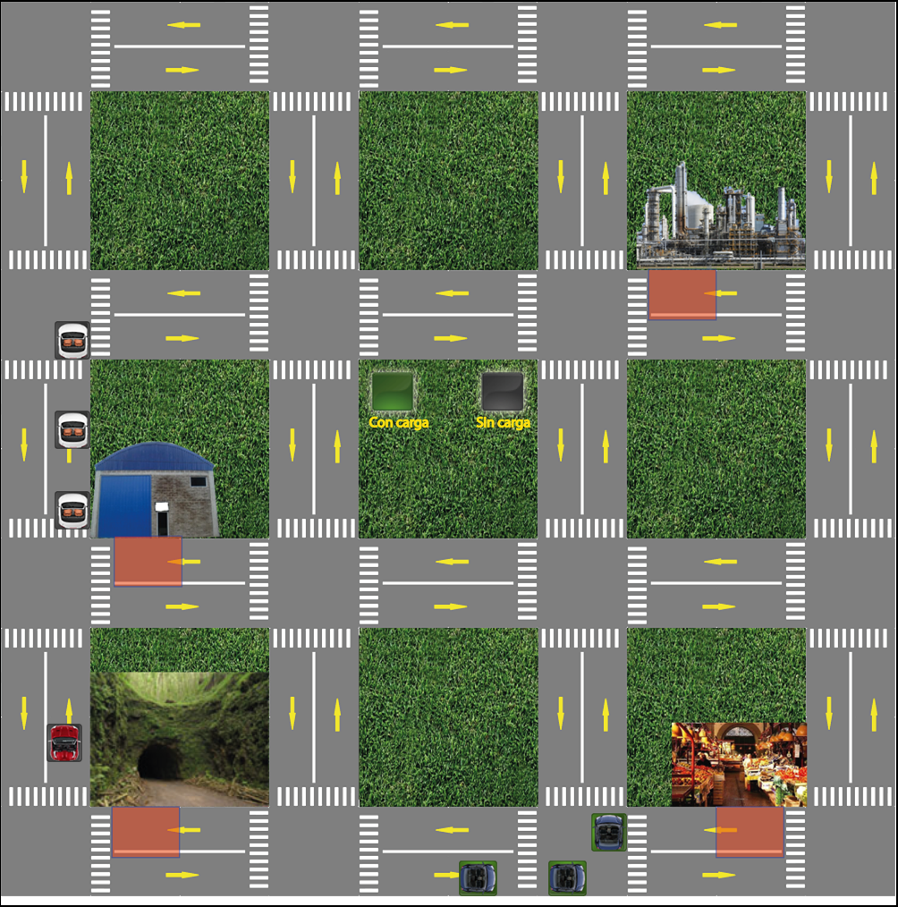
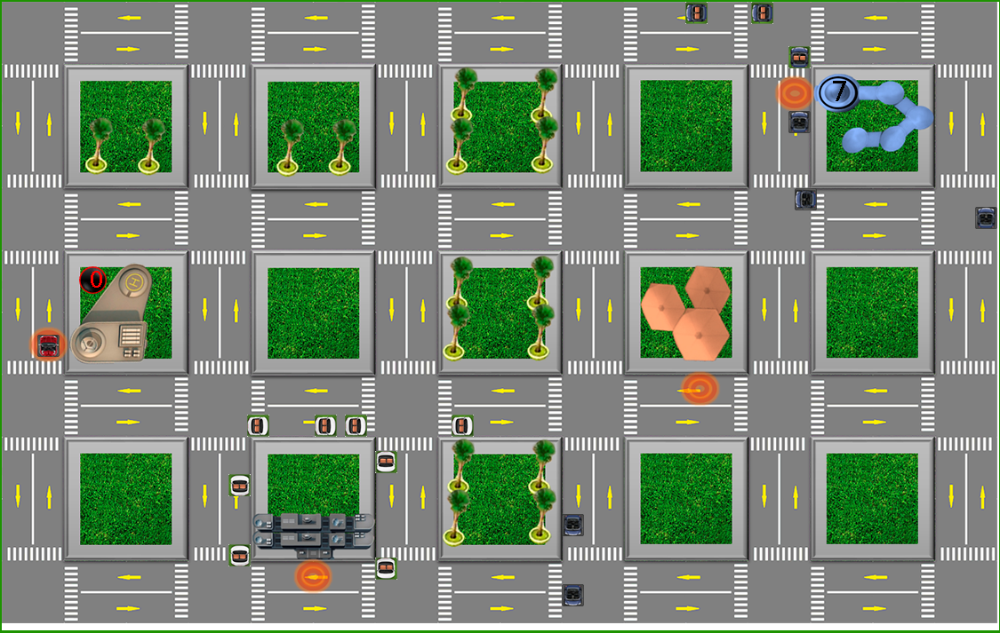

# Trabajo final de Programación Concurrente

El trabajo fue originalmente desarrollado usando Eclipse bajo Windows, pero es posible compilar en Linux usando los Makefiles que se proveen.

## Descripción

Cada auto azul y blanco del juego son diferentes hilos que tienen como sección crítica cada esquina de la ciudad. Estas esquinas están representadas mediante una red de Petri que evita que exista un interbloqueo en cada intersección.

## Capturas

### Juego prototipo.

### Juego final.

